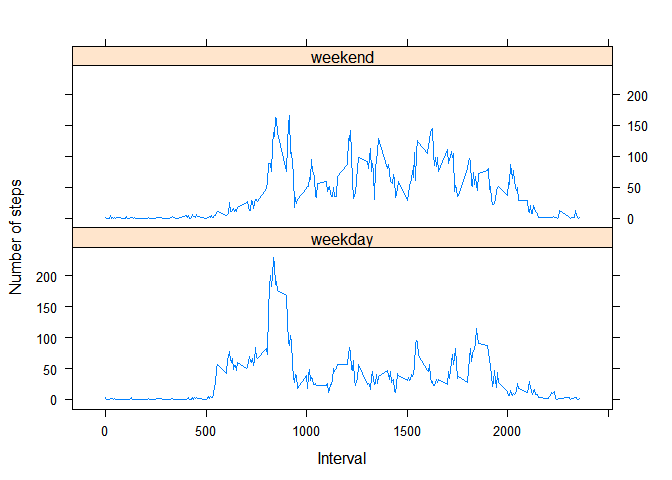

## Loading and preprocessing the data
Loading and preprocessing the data

```r
library(dplyr)
```

```
## 
## Attaching package: 'dplyr'
```

```
## The following objects are masked from 'package:stats':
## 
##     filter, lag
```

```
## The following objects are masked from 'package:base':
## 
##     intersect, setdiff, setequal, union
```

```r
file<- read.csv("activity.csv", stringsAsFactors = FALSE)
file$date<- as.Date(file$date)
fact_date<- as.factor(file$date)
```

## What is mean total number of steps taken per day?
Histogram of the total number of steps taken each day

```r
sum_per_day<-tapply(file$steps,fact_date,sum)
hist(sum_per_day,breaks=10,xlab="Total steps taken Daily",main= "Steps per day")
```

<!-- -->

```r
mean_val<-mean(sum_per_day,na.rm=T)
median_val<-median(sum_per_day,na.rm=T)
```
The mean of the total number of steps taken per day <span style="color: red;">10766.19</span> and the median is <span style="color: red;">10765</span>

## What is the average daily activity pattern?


Time series plot of the 5-minute interval and the average number of steps taken, averaged across all days

```r
activity_mean <-tapply(file$steps,factor(file$interval),mean,na.rm=T)
plot(activity_mean,type="l",xlab="Interval",ylab="Average steps",main="Average daily activity pattern")
```

<!-- -->

```r
max_step <- names(which.max(activity_mean))
```
The maximum number of steps, on average across all the days in the dataset was recorded at <span style="color: red;">835</span> interval


## Imputing missing values


```r
count_na<-sum(is.na(file))
##fill NA's by taking mean of tha interval across the dataset
##finding mean of each interval
av<-aggregate(steps~interval,file,mean,na.rm=T)
steps_new=list()
##Creating a new list that contains steps for all nas as well
for(i in 1: length(file[,3])){
 if(is.na(file$steps[i]))
         steps_new<-append(steps_new,av$steps[av$interval==file$interval[i]])
 else 
         steps_new<-append(steps_new,file$steps[i])
}
file_complete<-file
##replacing the steps variable with the newly found steps
file_complete$steps <- steps_new
file_complete$steps<-as.numeric(file_complete$steps)
head(file_complete,5)
```

```
##       steps       date interval
## 1 1.7169811 2012-10-01        0
## 2 0.3396226 2012-10-01        5
## 3 0.1320755 2012-10-01       10
## 4 0.1509434 2012-10-01       15
## 5 0.0754717 2012-10-01       20
```

```r
sum_per_day_new<-tapply(file_complete$steps,as.factor(file_complete$date),sum)
hist(sum_per_day_new,breaks=10,xlab="Total steps taken Daily on filling NA's",main= "Steps per day")
```

<!-- -->

```r
mean_val2<-mean(sum_per_day_new)
median_val2<-median(sum_per_day_new)
```

Total NA's in the dataset are <span style="color: red;">2304</span>

After imputing the NA's the new mean is <span style="color: red;">10766.19</span> and the median is <span style="color: red;"> 10766.19</span>

We can note that there is not much a difference in the mean and the median of the new dataset as I filled na's with the *mean*(whereas, upon filling it with the *median*, a notable difference can be seen) .However, the frequency of the steps increases because of the increase in available data (Check 1st and 3rd figure's Y axis to see this).

## Are there differences in activity patterns between weekdays and weekends?

The difference in activity pattern can be seen with the following plot

```r
library(lattice)
file_complete$weektime<- as.factor(ifelse(weekdays(file_complete$date) %in% c("Sunday","Saturday"),"weekend","weekday"))
head(file_complete,5)
```

```
##       steps       date interval weektime
## 1 1.7169811 2012-10-01        0  weekday
## 2 0.3396226 2012-10-01        5  weekday
## 3 0.1320755 2012-10-01       10  weekday
## 4 0.1509434 2012-10-01       15  weekday
## 5 0.0754717 2012-10-01       20  weekday
```

```r
mm<- file_complete %>%
        group_by(weektime,interval)%>%
        summarize(mean_steps = mean(steps))
with(mm,(xyplot(mean_steps~interval|weektime,type="l",xlab="Interval",ylab="Number of steps",layout=c(1,2))))
```

<!-- -->
